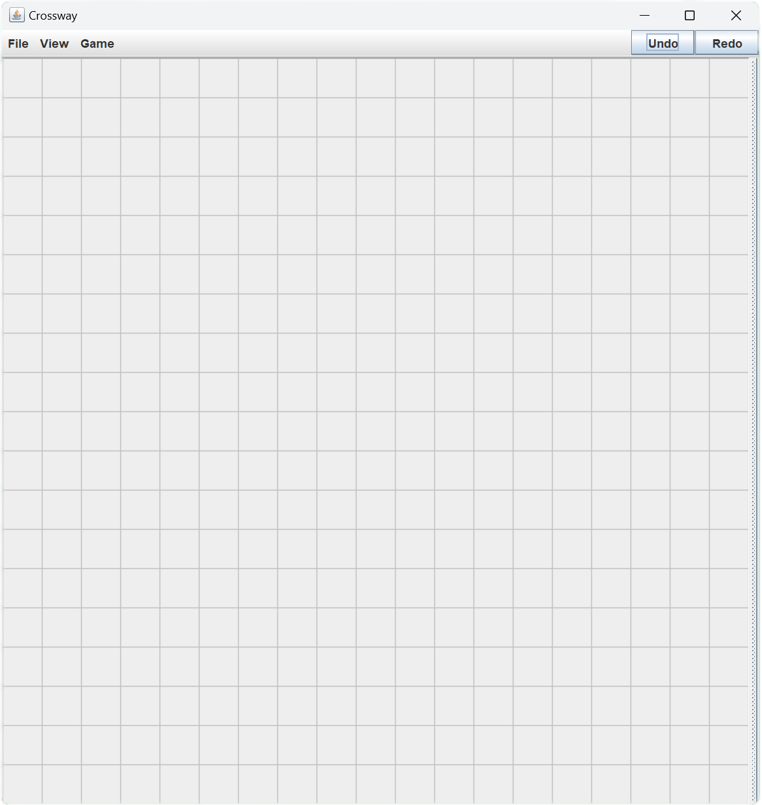
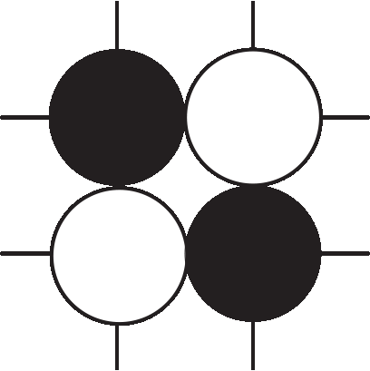
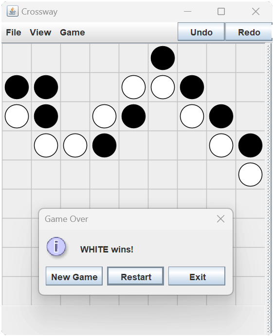

# Crossway Rules

*By Mark Steere*  
*Copyright © May 2007*

---

## Introduction
Crossway is played with a **Go set**. The board starts out empty.

[//]: # (![Empty board]&#40;resources/img/empty-board.png&#41;)
 
Each player controls all the stones of one color.  
Draws and ties cannot occur in Crossway.

---

## Stone Placement
- Players take turns placing **one stone per turn**.
- A player must **never** complete the formation shown below or any **90° rotation** of it.
 
- **Black** makes the first move.
- If you have **no available placements**, you forfeit your turn.  
  Your opponent continues until they achieve their winning connection.

Crossway also uses the **Pie Rule**. Black makes the first placement. White then has the option of switching colors with Black, and claiming Black’s first move as his own. If White chooses to exercise the Pie rule, Black then becomes White and now makes the second move of the game. The Pie rule can only be used once and only on the second move of the game.

---

## Object of the Game
- **White wins** by forming a contiguous sequence of white stones connecting the **West** edge to the **East** edge of the board.
- **Black wins** by connecting the **North** edge to the **South** edge.
- Stones in a winning sequence must be connected **horizontally, vertically, or diagonally**.
- Corners count as part of **both adjoining edges**.

The picture below illustrates a White win on a smaller board.
 

---

## Author’s Note
You may:
- Publish this rule sheet.
- Program the game for online or offline play.

**Conditions:**
- Do not change the name or rules.
- Attribute the game to *Mark Steere*.

More games by the author: [marksteeregames.com](http://marksteeregames.com)

